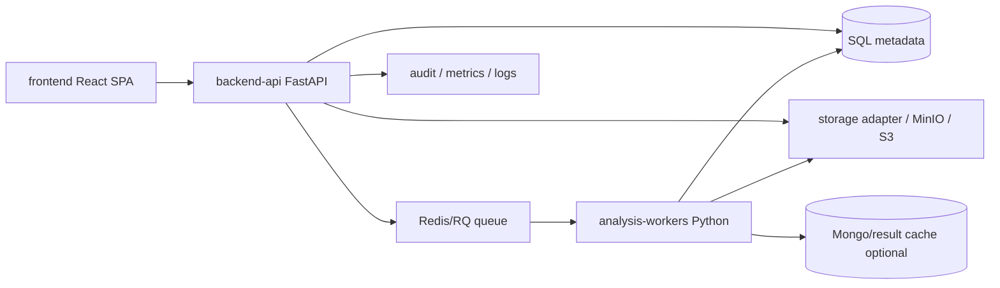

# 企业级分析平台参考与重构优化建议

> 更新日期：2026-06-29
> 适用范围：在 `frontend-backend-separation-refactor.md` 与 `migration-progress.md` 基础上，补充企业级分析平台参考、当前重构盘点和下一阶段优化路线。

## 1. 当前重构内容盘点

根据当前代码与 `docs/migration-progress.md`，项目已经从 Flask 单体向“独立前端 + API 平台 + Python worker + 统一任务 + 存储抽象”迈出较大一步。

| 领域 | 当前状态 | 关键文件/目录 | 风险与缺口 |
|---|---|---|---|
| 前端独立化 | Vite + React + TypeScript SPA 已建立，Dashboard/Database/ScriptHub 页面已拆分 | `frontend/` | 仍缺完整设计系统文档、端到端交互验证、与 OpenAPI 自动类型生成 |
| 稳定 API | Flask 已提供 projects/assets/jobs/results 稳定面；FastAPI 也开始实现真实 SQL 路由 | `flask_app/routes/api_projects.py`, `flask_app/routes/api_jobs.py`, `backend-api/` | FastAPI 认证权限仍是占位，部分 SQL row mapping 脆弱，缺 repository/service 层 |
| 任务系统 | `/api/jobs`、SSE、结果归一化、RedisJobQueue、worker dispatcher 已就位 | `flask_app/services/job_queue.py`, `analysis_workers/` | Worker 写回 result assets 的统一协议仍不完整；旧模块专属 task endpoint 仍存在 |
| Worker 化 | `analysis_workers/` 已有模块 worker 路由表，Redis/RQ 可入队 `module + job_id` | `analysis_workers/main.py`, `analysis_workers/tasks/` | 各 worker 多数仍是对旧 Flask endpoint 的桥接，尚未完全从 HTTP route 解耦 |
| 存储抽象 | LocalStorageAdapter、S3Adapter、storage_uri 兼容桥已完成 | `flask_app/services/storage_adapter.py`, `backend-api/app/core/storage.py` | MinIO/S3 实际部署和全链路验收未完成 |
| 数据库治理 | 列表分页、metadata 大字段规避已有推进 | project/assets/jobs APIs | 缺统一 repository，部分 FastAPI raw SQL 使用 `SELECT *` 和列下标 |
| 文档与契约 | 架构文档、OpenAPI 草案、迁移进度文档齐全 | `docs/architecture/`, `docs/api/` | OpenAPI 尚未成为前端类型和后端测试的单一契约来源 |

当前结论：重构已经进入后半段，但“企业级平台化”的关键缺口在认证权限、领域服务层、worker 结果协议、插件/模块注册治理、可观测性和部署拓扑。

## 2. GitHub 企业级平台参考

本次参考了以下开源企业级分析/数据平台的 GitHub 项目与文档：

| 平台 | 技术与架构特征 | 可借鉴点 |
|---|---|---|
| [Apache Superset](https://github.com/apache/superset) | Flask/Python 后端、React/TypeScript 前端、Celery/Redis 异步任务、SQLAlchemy 数据访问、插件化图表 | 和本项目技术栈最接近；适合参考“Python 分析后端 + 独立前端 + 异步任务 + 图表插件”的演进路线 |
| [Metabase](https://github.com/metabase/metabase) | 单体但边界清晰，前端应用和后端 API 分离，查询执行、权限、可视化模型稳定 | 适合参考问题/查询/结果模型，以及产品级分析体验 |
| [Grafana](https://github.com/grafana/grafana) | Go 后端、React 前端、数据源插件、面板插件、统一权限和组织模型 | 适合参考插件系统、数据源抽象、面板/结果查看器架构 |
| [DataHub](https://github.com/datahub-project/datahub) | 元数据平台，前端、GraphQL/API、摄取任务、搜索索引、权限治理分层 | 适合参考资产/元数据治理、摄取 pipeline、审计与搜索能力 |
| [OpenMetadata](https://github.com/open-metadata/OpenMetadata) | 数据治理平台，API server、ingestion、UI、workflow 分层 | 适合参考元数据 schema、连接器、数据资产生命周期 |
| [Apache Airflow](https://github.com/apache/airflow) | Web UI、scheduler、worker、DAG、operator/task 分离 | 适合参考长任务编排、重试、调度、任务状态机 |
| [MLflow](https://github.com/mlflow/mlflow) | Tracking server、artifact store、model registry、UI | 适合参考分析结果/模型/产物的 artifact 管理方式 |

### 2.1 共同设计规律

这些平台虽然技术栈不同，但企业级架构有高度一致的模式：

1. 前端不直接理解执行细节，只依赖稳定 API、schema 和状态机。
2. 后端 API 不直接承担长计算，而是创建任务、校验权限、返回状态。
3. Worker 只接收任务 ID，从数据库/对象存储读取输入，写回进度和产物。
4. 文件与结果一律 artifact/asset 化，不把大结果塞进业务表。
5. 模块能力通过 registry/plugin/connector 注册，而不是散落在 route 中。
6. 权限、组织、审计、配额和可观测性属于平台层，不属于单个分析模块。
7. API 契约、前端类型、后端测试需要从同一份 schema 派生。

## 3. 对本项目的目标架构修正

建议将当前目标架构细化为五个稳定边界：



| 边界 | 长期职责 | 当前优化方向 |
|---|---|---|
| Frontend | 项目、资产、任务、结果、配置、权限 UI | 引入 OpenAPI 生成类型；建立结果查看器和任务控制台 |
| Backend API | 认证、授权、项目、资产、任务、结果、审计 | 从 raw SQL route 过渡到 repository/service；补 Auth/User |
| Workers | 分析执行、进度、产物注册 | 每个 worker 只接收 `job_id`；输出统一 `JobOutput` 和 result assets |
| Storage | 输入文件、结果包、HTML/PNG/PPT/CSV/ZIP | MinIO/S3 实际部署；storage_uri 成为唯一稳定引用 |
| Metadata DB | 结构化元数据、状态、索引 | 拆大 JSON；补索引；避免列表读取 metadata 大字段 |

## 4. 下一阶段优化路线

### 4.1 Phase A：API 平台硬化

目标：让 FastAPI 真正成为可独立运行的平台 API，而不是 Flask 的旁路草稿。

优先任务：

| 任务 | 说明 | 验收证据 |
|---|---|---|
| Auth/User 最小闭环 | 支持迁移期 API token；后续接 session/JWT/RBAC | `/api/auth/me`、业务 API 未授权返回 401 |
| Repository 层 | 把 FastAPI raw SQL 从 route 移到 `repositories/` | route 中不再出现 `SELECT *` 和列下标映射 |
| Project/Asset/Job service | 统一权限、分页、排序、错误处理 | 单测覆盖分页、404、权限、空结果 |
| OpenAPI 契约治理 | OpenAPI 生成 TS 类型，并校验后端响应 | CI 中跑 schema compatibility tests |

建议目录：

```text
backend-api/app/
  api/
  core/
  models/
  schemas/
  repositories/
    projects.py
    assets.py
    jobs.py
  services/
    auth_service.py
    job_service.py
    asset_service.py
```

### 4.2 Phase B：Worker 结果协议闭环

目标：Worker 不仅能执行任务，还要按统一协议写回结果、注册资产、暴露下载/预览入口。

建议统一 worker 返回结构：

```json
{
  "job_id": "job_xxx",
  "module": "treemap.generate",
  "summary": {},
  "outputs": [
    {
      "label": "Treemap Viewer",
      "kind": "html",
      "storage_uri": "local://results/job_xxx/viewer.html",
      "asset_id": "asset_xxx"
    }
  ],
  "metrics": {
    "sample_count": 12,
    "duration_seconds": 36.4
  }
}
```

落地步骤：

1. 新建 `analysis_workers/results.py`，提供 `register_job_output(job_id, local_path, kind, label)`。
2. Worker 写文件后调用统一注册函数，生成 `ProjectAsset` 或目标 `assets` 记录。
3. `/api/jobs/{job_id}/results` 只从 job result + job_assets/assets 表聚合，不扫描文件系统。
4. 旧 Flask module route 返回的结果逐步改为调用同一注册函数。

### 4.3 Phase C：分析模块插件化

参考 Grafana/Superset 的插件模式，把 Script Hub 和图表模块从“route 注册”升级为“module manifest 注册”。

建议 manifest：

```json
{
  "key": "treemap.generate",
  "label": "Treemap",
  "category": "visualization",
  "input_schema": {},
  "output_schema": {},
  "worker": "analysis_workers.tasks.treemap.run_treemap_job",
  "ui_entry": "frontend/features/script-hub/modules/treemap"
}
```

收益：

- `/api/jobs/modules` 自动来自 registry。
- 前端可以按 manifest 渲染模块选择、参数表单、结果类型。
- 新分析模块不用再改多个 route 和前端硬编码列表。

### 4.4 Phase D：资产与元数据治理

参考 DataHub/OpenMetadata，把项目资产从“文件列表”升级为“可治理的数据资产”。

建议补充：

| 能力 | 说明 |
|---|---|
| checksum | 去重和缓存复用 |
| lineage | job input/output 关系 |
| tags | profile、pep、transcriptome、result 等可查询标签 |
| schema snapshot | CSV/Excel 字段、行数、样本名、链类型 |
| quality status | uploaded、validated、invalid、archived |
| audit log | 上传、删除、预览、下载、任务运行记录 |

### 4.5 Phase E：企业级运维与可观测性

建议新增最小运维能力：

- `/api/health`：API、DB、Redis、Storage 分项健康检查。
- `/api/metrics`：任务数量、失败率、队列长度、平均耗时。
- job history 标准化：queued、started、progress、output_registered、completed。
- error taxonomy：用户输入错误、数据格式错误、worker 执行错误、存储错误、系统错误。
- Docker Compose profile：`dev`、`worker`、`minio`、`fastapi`。

## 5. 优先级建议

下一轮建议按以下顺序推进：

1. FastAPI Auth/User 最小闭环
   当前 Phase 5 最大空项，且是企业级平台前置条件。

2. Worker output registration
   让 Phase 3 从“能入队执行”进入“能沉淀资产和结果”的闭环。

3. FastAPI repository/service 层
   修复 raw SQL + 列下标映射的可维护性风险。

4. Module manifest registry
   为 Script Hub 后续扩展建立插件化基础。

5. OpenAPI → frontend generated types
   把前端、API、文档从“人工同步”升级为契约驱动。

## 6. 本项目重构完成定义

在企业级标准下，不能只以“页面能打开、任务能跑”为完成。建议把完成定义改为：

| 维度 | 完成标准 |
|---|---|
| 前端 | 不依赖 Flask Jinja；所有新页面只调用稳定 API |
| API | FastAPI 覆盖 projects/assets/jobs/results/auth，具备权限和错误治理 |
| Worker | 所有长任务只接收 job_id，写回统一 progress/result/assets |
| Storage | 新资产和结果只暴露 storage_uri，不泄漏本地 Windows path |
| DB | 列表接口分页，不读大 JSON；关键查询有索引 |
| 运维 | Docker 一键启动 API、worker、Redis、DB、MinIO；健康检查可见 |
| 文档 | OpenAPI、迁移进度、部署说明、模块 manifest 一致 |

## 7. 推荐的近期 PR 切分

| PR | 主题 | 主要改动 |
|---|---|---|
| PR-1 | FastAPI Auth/User bridge | `API_AUTH_TOKEN`、`/api/auth/me`、业务 route dependency |
| PR-2 | Worker output registration | `analysis_workers/results.py`、job output assets、结果 API 聚合 |
| PR-3 | Repository extraction | `backend-api/app/repositories/*`、raw SQL 从 route 移出 |
| PR-4 | Module manifest registry | `analysis_modules/*.json`、统一 `/api/jobs/modules` 来源 |
| PR-5 | OpenAPI type generation | 生成 `frontend/src/shared/api/generated`，替换手写类型 |

这组切分可以在不破坏现有 Flask 可用性的前提下，继续保持绞杀者迁移节奏。
